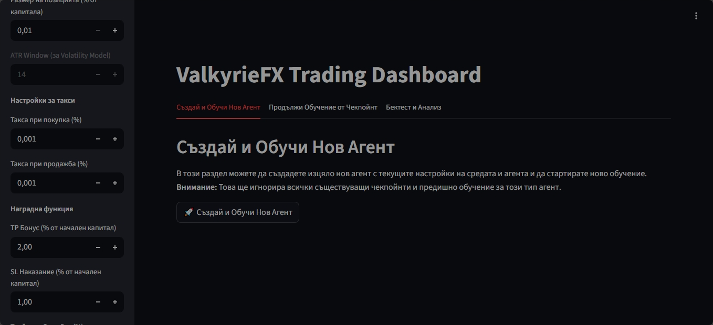
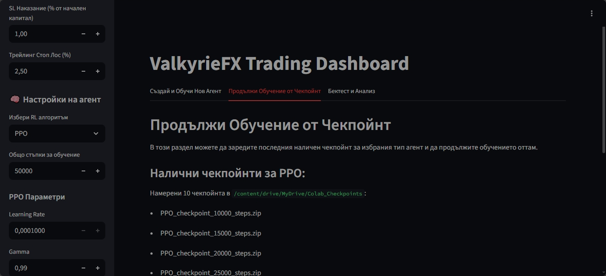
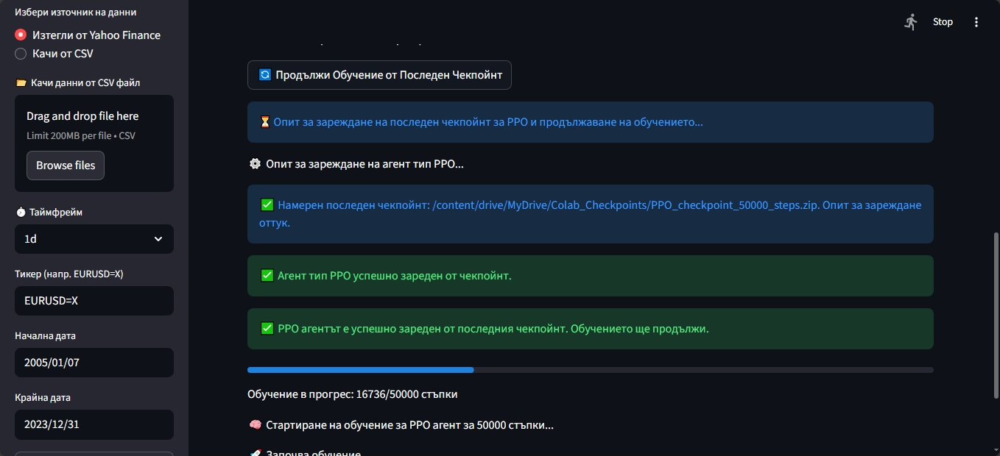
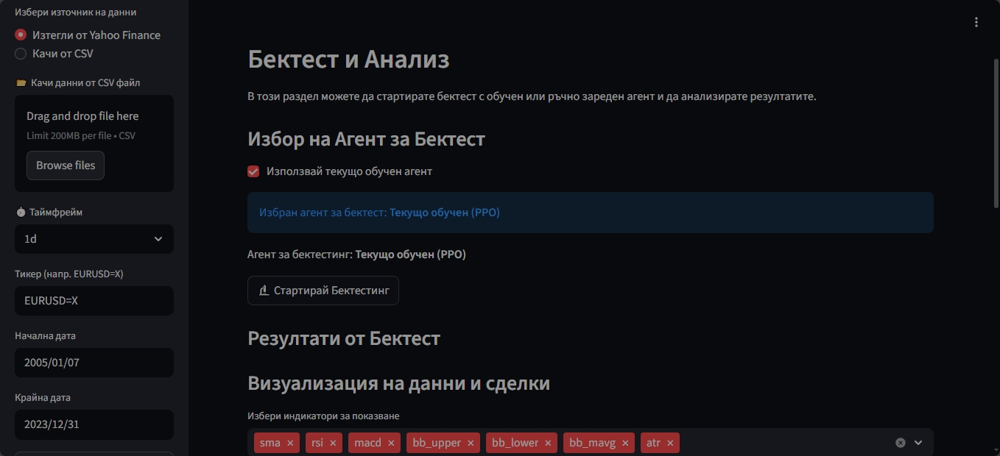
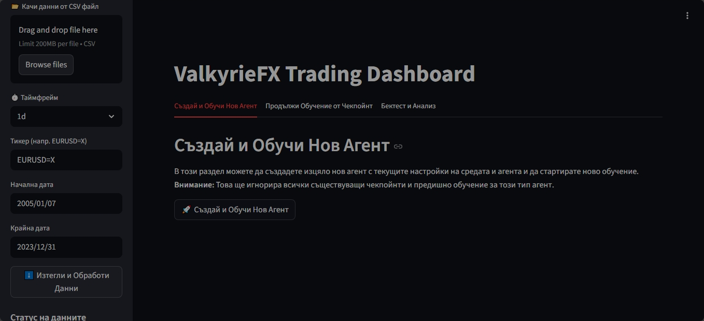

# VFX-0251-R.ipynb

# Valkiria VX ⚔️  
**AI Ensemble Trading Platform**

Валкирия ВХ е експериментална платформа за алгоритмична търговия, изградена като ансамбъл от три агента.  
Всеки агент има собствена роля, обучава се чрез подсилващо обучение (RL), записва чекпойнти и се преобучава, за да постигне по-добра хармония с пазара.  

---

## 📒 Colab Notebook
За бърз старт и експерименти можете да използвате готовия Colab бележник:  

[](https://colab.research.google.com/drive/131jzBefP_3nFULQ6Bbu3czVNhGU8nd1r#scrollTo=DcC_HZZfaGE)

**Notebook:** `VFX-0251 R.ipynb`  

Бележникът съдържа:  
- ⚙️ Настройки на средата и глобални параметри  
- 📈 Зареждане и обработка на данни (Yahoo Finance или CSV)  
- 🧠 Обучение на агентите с RL алгоритми (напр. A2C)  
- 💾 Чекпойнтинг и управление на модели  
- 📊 Визуализация на резултатите  

---

## ✨ Основни характеристики
- 📈 **Гъвкави източници на данни** – Yahoo Finance или CSV файлове  
- ⏱️ **Множество таймфрейми** – от дневни до минутни данни  
- ⚙️ **Глобални настройки** – капитал, lookback прозорец, риск мениджмънт  
- 🛡️ **Риск контрол** – стоп-лос, тейк-профит, максимален спад на портфейла, трейлинг стоп  
- 📦 **Управление на модели** – запазване и зареждане на агенти, продължаване на обучение от чекпойнт  
- 🧠 **Подсилващо обучение** – поддръжка на алгоритми като A2C  
- 📊 **Бектест и анализ** – разделяне на данни за обучение и тест, визуализация на резултатите  

---

## 🚀 Стартиране локално
1. Клонирайте репото:  
   ```bash
   https://github.com/AlexKitipov/VFX-0251-R.ipynb.git

## 📸 Интерфейс на таблото

### Стъпка 1: Начален изглед


### Стъпка 2: Зареждане на данни


### Стъпка 3: Конфигурация на средата


### Стъпка 4: Обучение на агентите


### Стъпка 5: Визуализация на резултати



---

⚠️ **ВАЖНО: Настройки, които силно влияят на обучението на агентите**

За да постигнете стабилно и реалистично обучение, е критично да настроите правилно следните параметри:

### 📌 Размер на позицията (`position_size`)
- **По подразбиране:** 18% от капитала (твърде агресивно)
- **Препоръчително:** 0.1%, 0.01% или максимум 1%  
  Това намалява риска и позволява на агентите да учат без да фалират при малки грешки.

### 💸 Комисионна (`commission`)
- **По подразбиране:** 0.1  
- **Препоръчително:** 0.01 или по-ниска  
  Високата комисионна изяжда печалбата и затруднява обучението.

### 🧠 Learning Rate (`learning_rate`)
- **Препоръчителен диапазон:** `1e-4` до `5e-4`  
  Твърде висок learning rate води до нестабилно обучение, твърде нисък — до бавно учене.

### ⏳ Lookback Window (`lookback`)
- Оптимален диапазон: `20` до `100`  
  По-къс прозорец = по-бърза реакция, но по-малко контекст. По-дълъг = по-добра адаптация.

### 🛡️ Risk Management
- **Stop Loss / Take Profit:** Настройте разумни нива според волатилността.
- **Max Drawdown:** Ограничете до 10–20% за реалистично поведение.
- **Trailing Stop:** Активирайте за динамична защита на печалбата.

---

❗ Неправилните настройки могат да доведат до неуспешно обучение, фалити на агенти или нереалистични резултати. Препоръчва се да започнете с консервативни стойности и постепенно да експериментирате.

---

🚀 **Стартиране на интерфейса в Colab**

След като заредите всички клетки в бележника (`VFX_0251_R.ipynb`), следвайте тези стъпки, за да стартирате интерфейса и да осигурите запис на чекпойнтите:

### ✅ Стъпка 1: Зареждане на всички клетки
- Изпълнете клетките една по една, отгоре надолу.
- Уверете се, че всички библиотеки са инсталирани успешно.
- Ако някои клетки за инсталиране на **Gemini Pro** дават грешка — **можете спокойно да ги премахнете или пропуснете**. Те не съдържат API и **не влияят на работата на интерфейса**.

### 🔗 Стъпка 2: Стартиране на Cloudflare тунела
- В **предпоследната клетка** ще се появи URL адрес, започващ с `https://trycloudflare.com/...`
- Това е публичният линк към Streamlit интерфейса.
- Кликнете върху него, за да отворите таблото в нов прозорец.

### 📦 Стъпка 3: Маунтване на Google Drive
- За да се записват чекпойнтите и моделите, е необходимо да маунтнете своя Google Drive.
- Изпълнете клетката с:
  ```python
  from google.colab import drive
  drive.mount('/content/drive')
⚠️ ВНИМАНИЕ: Без маунтнат Google Drive, агентите няма да могат да записват чекпойнти и обучението ще се загуби при рестарт на сесията.
